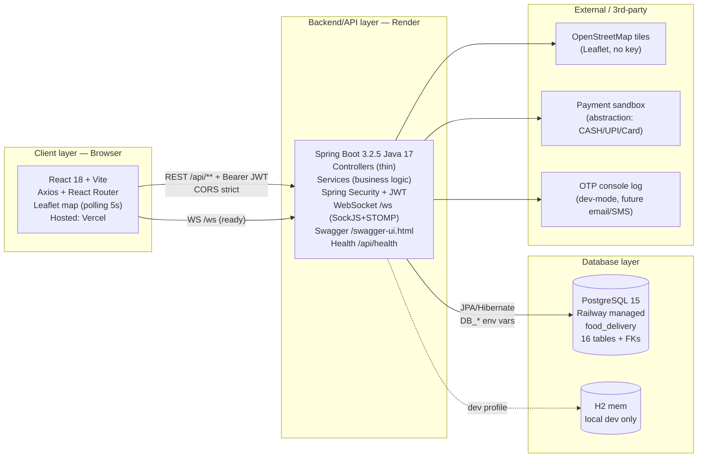

# System Architecture — Food Delivery and Live Tracking (Java track)

> Source: Mermaid below + export PNG via draw.io/Excalidraw for review. Keep this file + PNG in same folder.

## Hosting boundary
| Piece | Platform | Env |
|-------|----------|-----|
| Frontend | Vercel | `VITE_API_URL=https://<backend>.onrender.com/api` |
| Backend | Render (Java, `mvn clean package`) | `SPRING_PROFILES_ACTIVE=prod`, `DB_*`, `JWT_SECRET`, `CORS_ALLOWED_ORIGINS` |
| DB | Railway PostgreSQL 15 | connection string → `DB_HOST/PORT/NAME/USER/PASSWORD` |

## Request flow
Browser → Vercel static → Render `/api/**` (JWT) → JPA → Railway Postgres → `{success,data,message}` JSON + correct HTTP codes.
