# Class / Module Diagram — Java track (matches actual code)

```mermaid
classDiagram
  class FoodDeliveryApplication
  class AuthController
  class RestaurantController
  class MenuItemController
  class CategoryController
  class CartController
  class OrderController
  class DeliveryController
  class DeliveryPartnerController
  class AddressController
  class PaymentController
  class ReviewController
  class FavoriteController
  class UserController
  class AdminController
  class HealthController

  class AuthService
  class RestaurantService
  class MenuItemService
  class CategoryService
  class CartService
  class OrderService
  class DeliveryService
  class AddressService
  class PaymentService
  class ReviewService
  class FavoriteService
  class UserService

  class User
  class OtpToken
  class Restaurant
  class MenuCategory
  class MenuItem
  class Address
  class Cart
  class CartItem
  class Order
  class OrderItem
  class Payment
  class Delivery
  class DeliveryPartner
  class DeliveryLocation
  class Review
  class Favorite

  class UserRepository
  class OtpTokenRepository
  class RestaurantRepository
  class MenuItemRepository
  class MenuCategoryRepository
  class AddressRepository
  class CartRepository
  class CartItemRepository
  class OrderRepository
  class OrderItemRepository
  class PaymentRepository
  class DeliveryRepository
  class DeliveryPartnerRepository
  class DeliveryLocationRepository
  class ReviewRepository
  class FavoriteRepository

  AuthController --> AuthService
  RestaurantController --> RestaurantService
  MenuItemController --> MenuItemService
  CategoryController --> CategoryService
  CartController --> CartService
  OrderController --> OrderService
  DeliveryController --> DeliveryService
  AddressController --> AddressService
  PaymentController --> PaymentService
  ReviewController --> ReviewService
  FavoriteController --> FavoriteService
  UserController --> UserService

  AuthService --> UserRepository
  AuthService --> OtpTokenRepository
  OrderService --> OrderRepository
  OrderService --> OrderItemRepository
  OrderService --> CartRepository
  OrderService --> PaymentRepository
  OrderService --> DeliveryRepository
  CartService --> CartRepository
  CartService --> CartItemRepository
  CartService --> MenuItemRepository
  DeliveryService --> DeliveryRepository
  DeliveryService --> DeliveryLocationRepository
```

Thin controllers (no business logic) → Services (transactions, pricing, status transitions) → Repositories (JPA, no raw SQL) → Entities.
Cross-cutting: `SecurityConfig`, `JwtUtil`, `JwtAuthFilter`, `SwaggerConfig`, `GlobalExceptionHandler`, `ApiResponse<T>{success,data,message}`.
